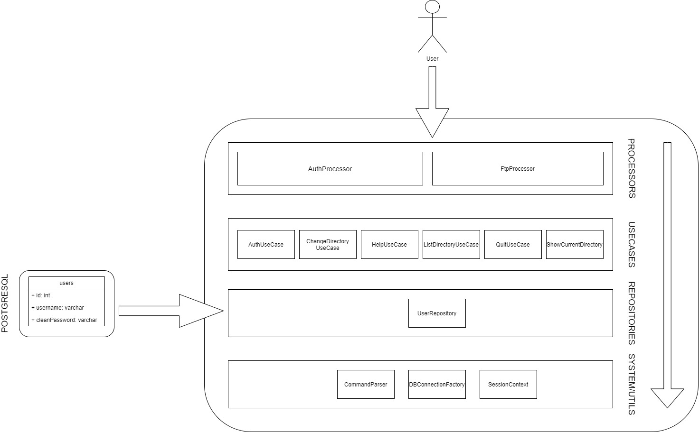
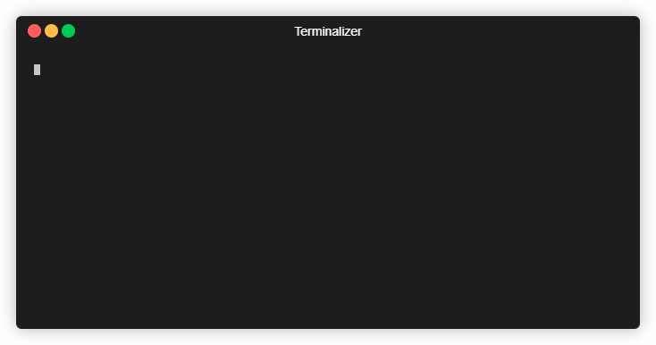

# FTP Imitation
[](https://travis-ci.com/VolLol/ftpimitation)

Пример реализации FTP сервера для демонстрации моих навыков программирования на Java. 

В рамках данной реализации были реализованы следующие команды: 
1. cd
1. ls
1. pwd
1. cd
1. quit

Так же сервер поддерживает аутентификацию, а данные пользователей хранятся в базе данных PostgresSQL(для доступа к базе данных используется JDBC).

# Схема приложения

На данной диаграмме изображены слои, олицетворяющие разделение функций приложения.
Слой Processors,отвечает за соединение клиента с сервером и определяет, какую команду требует исполнить пользователь.Он направляет программу в необходимый usecase.
После того, как было определено, какую команду потребовал пользователь, исполняется один из usecase. В данном слое находится бизнес логика приложения, информация о том, как должна быть выполнена команда.
В слое Repository скрыта реализация подключения к бд и выполнение запросов. База данных находится вне данной программы и требует отдельного подключения, реализованного в слое utils.
В слое Utils находятся системные классы, классы которые нельзя отнести к другим слоям.

В данной программе приняты следующие правила:
1. Движение данных происходит по следующему принципу: Processor может получать данные от пользователя и передавать их в Usecase. Слой Useсase может передавать данные в Processor и Repository. Слой Repository может использовать данные из слоя Utils/Systems или выполнять передачу в Usecase.
1. Нарушение вышеизложеннго принципа допустимо только для классов из слоя Utils/System.


# Сборка и запуск проекта локально
Для работы требуется база данных PostgreSQL. Для этого можно использовать Docker, выполнив следующую команду:
```bash
docker-compose.exe up -d
```
После этого необходимо создать базу данных:
```postgresql
create database ftpimitationdb;
```
Далее необходимо создать таблицу в базе данных со следующими полями и заполнить своими значениями:

```sql
create table users
(
 userid int not null,
 username varchar not null,
 cleanpassword varchar not null,
 primary key(userid)
)
```

Для того, чтобы запустить сервер достаточно выполнить следующую команду в консоли:
```bash
./gradlew run
```
После чего необходимо используя программу Telnet подключится к серверу на порт 2101.

## Демонстрация работы со стороны клиента:


## Демонстрация работы со стороны сервера:
